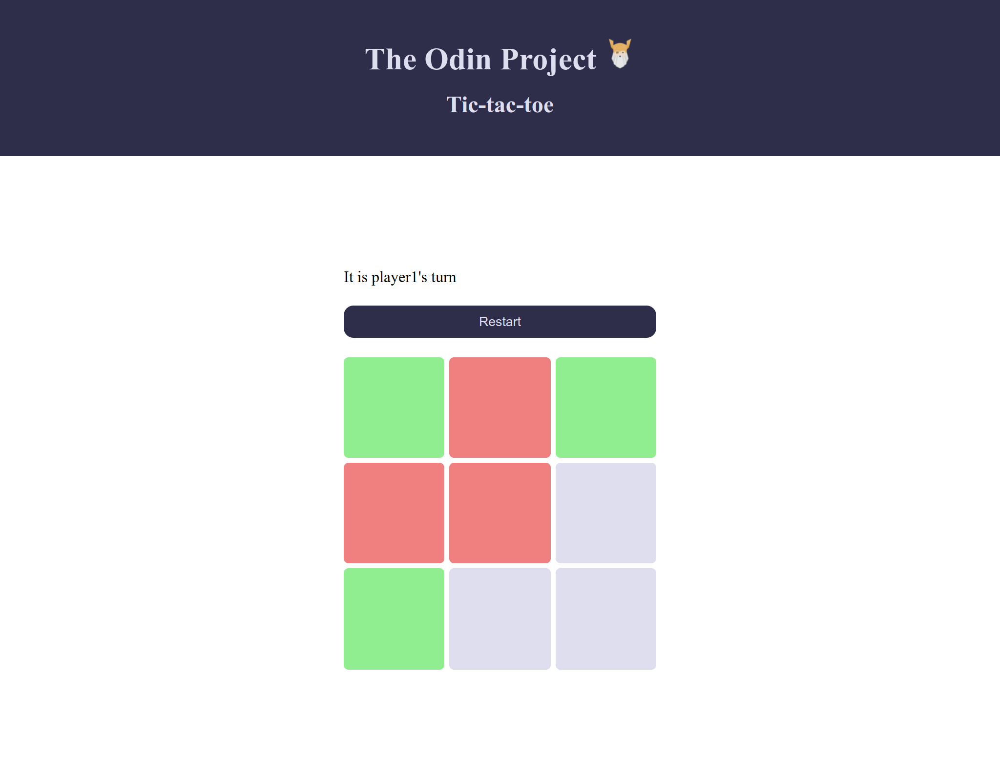

# The Odin Project - Tic-tac-toe

Please see [The Odin Project](https://www.theodinproject.com/paths/full-stack-javascript/courses/javascript/lessons/tic-tac-toe) for project description. 

## Aim
The aim of this project was to implement factory functions and use the module pattern. 

As an additional challenge, we needed to implement an AI using the minimax theorem. 

## Live Version

See [here](https://cdevelopment010.github.io/TOP-project-tic-tac-toe/) for live project. 
